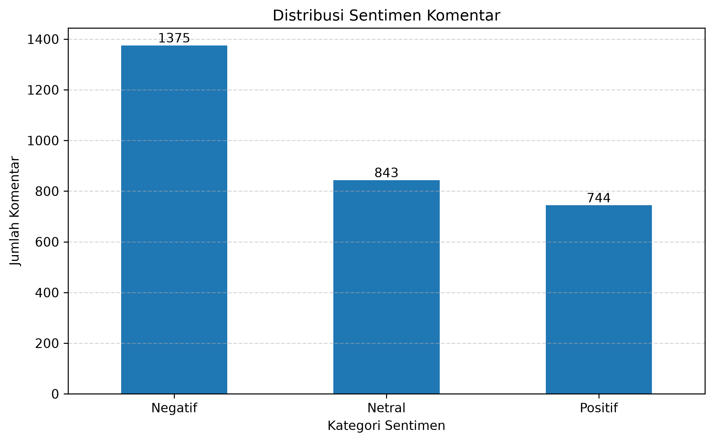
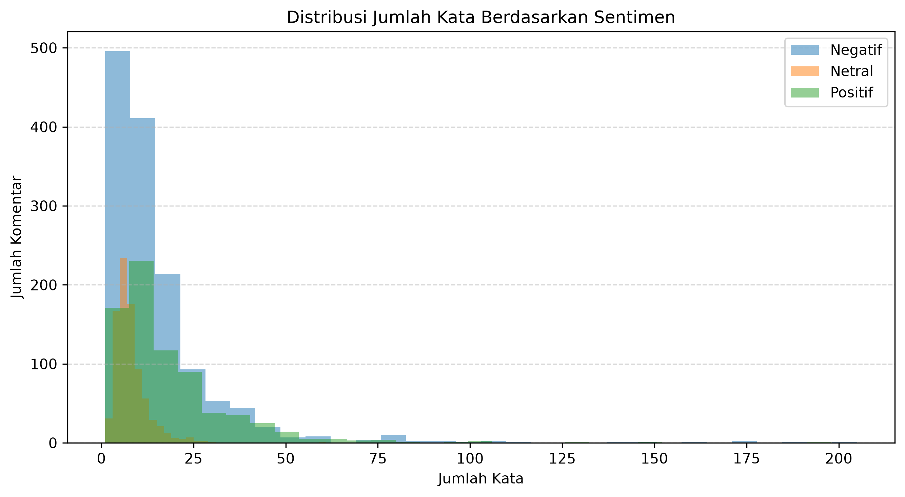
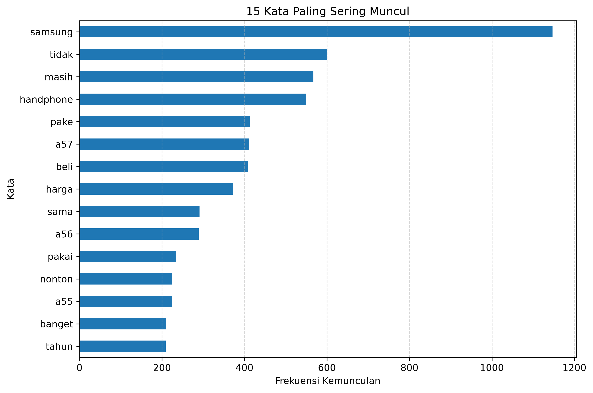
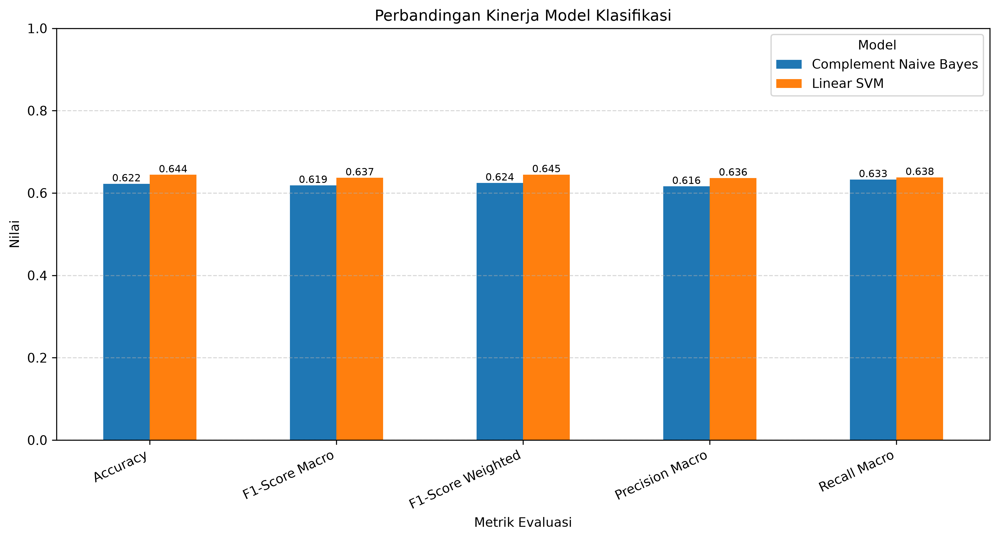
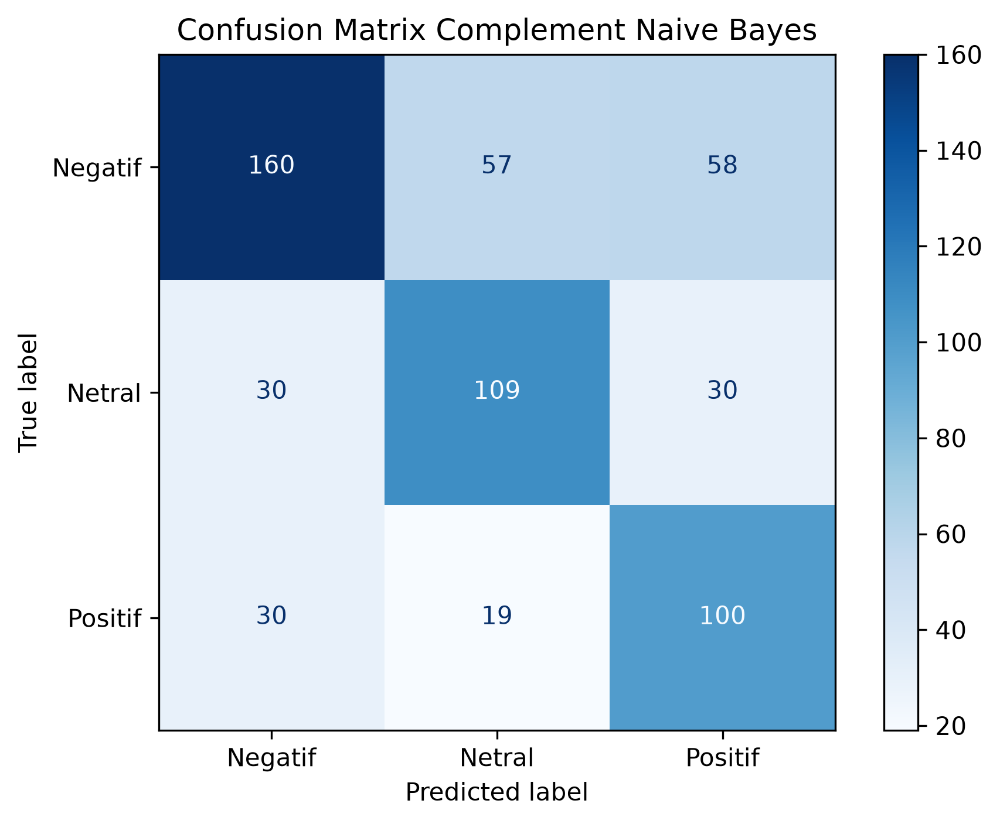
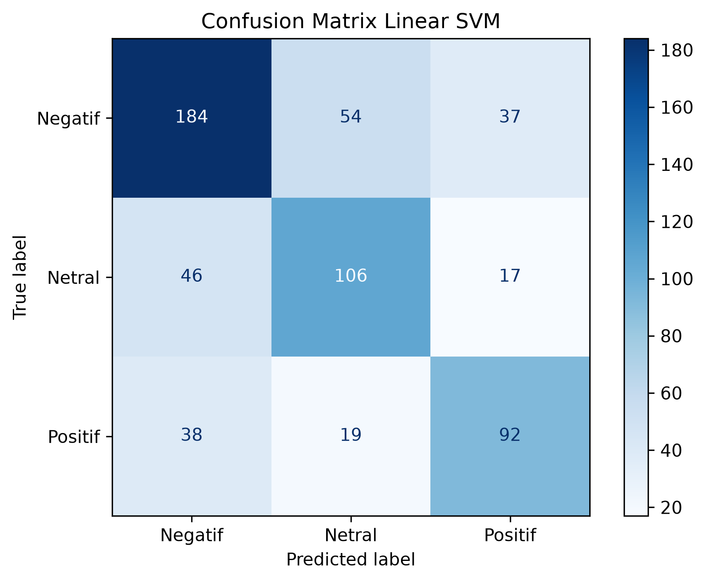

# LAPORAN UAS KECERDASAN BUATAN

## Analisis Sentimen Komentar YouTube terhadap Samsung Galaxy A57 Menggunakan Complement Naive Bayes dan Linear Support Vector Machine

---

## Identitas Kelompok

| Keterangan | Isi |
|---|---|
| Anggota 1 | Anwar Ibrahim |
| NIM | 2406017 |
| Anggota 2 | Rahmat Apandi |
| NIM | 2406006 |
| Kelas | A |
|Program Studi | Teknik Informatika |
| Mata Kuliah | Kecerdasan Buatan |
| Dosen Pengampu | Leni Fitriani, S.T., M.Kom. |

---
# 1. Judul Proyek

**Analisis Sentimen Komentar YouTube terhadap Samsung Galaxy A57 Menggunakan Complement Naive Bayes dan Linear Support Vector Machine**

Domain proyek ini adalah **Natural Language Processing**, khususnya klasifikasi sentimen teks berbahasa Indonesia. Objek penelitian berupa komentar tingkat teratas pada video GadgetIn berjudul *“Samsung terlalu nyaman ~ Review Galaxy A57 Indonesia!”* dengan ID video `ZGbp60qeIUM`.

---

# 2. Business Understanding

## 2.1 Latar Belakang

YouTube tidak hanya digunakan sebagai media hiburan, tetapi juga menjadi sumber informasi bagi konsumen sebelum mengambil keputusan pembelian. Video ulasan smartphone biasanya memperoleh banyak komentar yang berisi penilaian terhadap desain, harga, performa, kamera, baterai, sistem operasi, dan perbandingan dengan produk lain.

Jumlah komentar yang besar menyebabkan analisis manual membutuhkan waktu dan tenaga yang cukup banyak. Selain itu, komentar pengguna ditulis dalam bentuk teks tidak terstruktur, menggunakan singkatan, bahasa percakapan, kesalahan penulisan, emoji, dan campuran istilah teknologi. Oleh karena itu, dibutuhkan pendekatan kecerdasan buatan untuk mengelompokkan opini secara otomatis menjadi sentimen negatif, netral, dan positif.

Dalam klasifikasi teks, TF-IDF dapat digunakan untuk memberi bobot pada kata berdasarkan tingkat kepentingannya di dalam dokumen dan korpus (Salton & Buckley, 1988). Complement Naive Bayes dikembangkan untuk memperbaiki kelemahan asumsi Naive Bayes pada klasifikasi teks dan dapat bekerja dengan baik pada distribusi kelas yang tidak seimbang (Rennie et al., 2003). Sementara itu, Support Vector Machine membentuk batas keputusan dengan kemampuan generalisasi yang baik dan sesuai digunakan pada ruang fitur berdimensi tinggi (Cortes & Vapnik, 1995).

Penelitian ini juga menghadapi ketidakseimbangan jumlah anggota kelas. Kondisi tersebut dapat membuat model cenderung mempelajari kelas mayoritas, sehingga diperlukan penanganan khusus pada data training (He & Garcia, 2009). Evaluasi tidak hanya menggunakan accuracy, tetapi juga precision, recall, F1-score, dan confusion matrix karena setiap metrik memberikan informasi yang berbeda mengenai kinerja klasifikasi multikelas (Sokolova & Lapalme, 2009).

## 2.2 Permasalahan Dunia Nyata

Permasalahan yang diselesaikan dalam proyek ini adalah:

1. Banyaknya komentar membuat identifikasi kecenderungan opini secara manual menjadi tidak efisien.
2. Komentar YouTube bersifat tidak terstruktur dan mengandung bahasa informal.
3. Distribusi kelas sentimen tidak seimbang.
4. Perlu diketahui algoritma klasik yang lebih baik untuk mengklasifikasikan sentimen komentar berdasarkan fitur TF-IDF.
5. Diperlukan interpretasi kesalahan model agar hasil tidak hanya bergantung pada nilai accuracy.

## 2.3 Rumusan Masalah

1. Bagaimana distribusi sentimen komentar YouTube terhadap Samsung Galaxy A57?
2. Bagaimana proses pengumpulan, pembersihan, pelabelan, dan transformasi komentar menjadi fitur numerik?
3. Bagaimana kinerja Complement Naive Bayes dan Linear SVM berdasarkan accuracy, precision, recall, F1-score, dan confusion matrix?
4. Model manakah yang memiliki performa terbaik?
5. Apa keterbatasan model dan rekomendasi pengembangannya?

## 2.4 Tujuan Proyek

Proyek ini bertujuan untuk:

1. Mengumpulkan komentar YouTube melalui YouTube Data API v3.
2. Membersihkan dan menormalisasi teks komentar bahasa Indonesia.
3. Membentuk label sentimen negatif, netral, dan positif.
4. Melakukan Exploratory Data Analysis terhadap distribusi dan karakteristik komentar.
5. Mengubah teks menjadi fitur numerik menggunakan TF-IDF.
6. Menangani ketidakseimbangan kelas pada data training.
7. Melatih Complement Naive Bayes dan Linear SVM.
8. Membandingkan kinerja kedua model dan menentukan model terbaik.

## 2.5 Pengguna Sistem

Pihak yang berpotensi memanfaatkan hasil sistem adalah:

- **Konsumen**, untuk melihat kecenderungan tanggapan pengguna terhadap produk.
- **Produsen atau pemasar**, untuk mengidentifikasi persepsi dan kritik pengguna.
- **Kreator konten**, untuk memahami respons audiens terhadap video ulasan.
- **Peneliti atau mahasiswa**, sebagai dasar pengembangan analisis sentimen bahasa Indonesia.

## 2.6 Solusi dan Manfaat Implementasi AI

Solusi yang dibangun berupa pipeline klasifikasi sentimen otomatis. Sistem menerima teks komentar, melakukan preprocessing, mengubah teks menjadi vektor TF-IDF, lalu memprediksi sentimen menggunakan model klasifikasi.

Manfaat implementasinya adalah:

- Mempercepat pengelompokan komentar dalam jumlah besar.
- Memberikan ringkasan kuantitatif sentimen audiens.
- Membantu membandingkan efektivitas algoritma klasifikasi teks.
- Menjadi dasar pengembangan dashboard pemantauan opini pengguna.

---

# 3. Data Understanding

## 3.1 Sumber Data

Data berasal dari komentar tingkat teratas pada satu video YouTube di kanal GadgetIn. Pengambilan komentar dilakukan dengan metode `commentThreads.list` pada YouTube Data API v3 menggunakan parameter `videoId`, `part="snippet"`, dan `textFormat="plainText"`.

| Keterangan | Informasi |
|---|---|
| Platform | YouTube |
| Kanal | GadgetIn |
| Judul video | Samsung terlalu nyaman ~ Review Galaxy A57 Indonesia! |
| Video ID | `ZGbp60qeIUM` |
| Jenis komentar | Komentar tingkat teratas |
| Batas pengambilan | Maksimal 3.000 komentar |
| Data mentah tervalidasi | 2.981 komentar |
| Data akhir untuk analisis | 2.962 komentar |
| Bahasa dominan | Bahasa Indonesia |
| Format data | CSV |
| Tipe data | Teks tidak terstruktur |
| Target klasifikasi | Sentimen negatif, netral, dan positif |

YouTube Data API menyediakan metode untuk mengambil rangkaian komentar berdasarkan ID video. Pada proyek ini, balasan terhadap komentar tingkat teratas tidak dimasukkan ke dalam dataset.

## 3.2 Tahapan Dataset

| File | Jumlah baris | Keterangan |
|---|---:|---|
| `1_komentar_raw.csv` | 2.981 | Komentar mentah setelah validasi awal |
| `2_komentar_clean.csv` | 2.962 | Komentar setelah preprocessing |
| `3_komentar_labeled.csv` | 2.962 | Komentar beserta label dan confidence score |
| `4_dataset_hasil_eda.csv` | 2.962 | Dataset berlabel beserta fitur panjang komentar |

Sebanyak 19 komentar tidak digunakan karena menjadi kosong atau tidak memiliki token bermakna setelah proses preprocessing.

## 3.3 Deskripsi Atribut

| Atribut | Tipe | Deskripsi |
|---|---|---|
| `Komentar_Asli` | Teks | Isi komentar sebelum preprocessing |
| `Komentar_Labeling` | Teks | Komentar dengan pembersihan ringan untuk pelabelan |
| `Komentar_Bersih` | Teks | Komentar setelah preprocessing lengkap |
| `Sentimen` | Kategorikal | Label `Negatif`, `Netral`, atau `Positif` |
| `Confidence_Score` | Numerik | Tingkat keyakinan model pelabelan dalam persen |
| `Panjang_Karakter` | Numerik | Jumlah karakter pada komentar asli |
| `Jumlah_Kata` | Numerik | Jumlah kata pada komentar asli |

Variabel input utama untuk pemodelan adalah `Komentar_Bersih`, sedangkan target klasifikasi adalah `Sentimen`.

## 3.4 Distribusi Target

| Sentimen | Jumlah | Persentase |
|---|---:|---:|
| Negatif | 1.376 | 46,46% |
| Netral | 844 | 28,49% |
| Positif | 742 | 25,05% |
| **Total** | **2.962** | **100,00%** |

Kelas negatif merupakan kelas terbesar, sedangkan kelas positif merupakan kelas terkecil. Rasio kelas terbesar terhadap kelas terkecil adalah sekitar **1,85 : 1**, sehingga dataset dikategorikan tidak sepenuhnya seimbang.



## 3.5 Kualitas Data

Pemeriksaan dataset menunjukkan bahwa:

- Tidak terdapat nilai kosong pada dataset akhir.
- Tidak terdapat duplikasi pada kolom `Komentar_Asli`.
- Terdapat 22 nilai `Komentar_Bersih` yang sama karena beberapa komentar berbeda menghasilkan representasi teks yang identik setelah normalisasi dan stemming.
- Terdapat 375 komentar dengan confidence score pelabelan di bawah 60%, sehingga hasil pelabelan otomatis perlu diperlakukan sebagai pseudo-label dan bukan ground truth manusia.

---

# 4. Exploratory Data Analysis

## 4.1 Statistik Panjang Komentar

| Statistik | Panjang karakter | Jumlah kata |
|---|---:|---:|
| Rata-rata | 77,94 | 13,75 |
| Standar deviasi | 92,21 | 15,65 |
| Minimum | 2 | 1 |
| Kuartil 1 | 29 | 5 |
| Median | 49 | 9 |
| Kuartil 3 | 92 | 16 |
| Maksimum | 1.161 | 205 |

Komentar umumnya relatif pendek, tetapi terdapat beberapa komentar yang jauh lebih panjang daripada mayoritas data. Variasi panjang yang tinggi menunjukkan bahwa pengguna memberikan tanggapan mulai dari respons singkat hingga ulasan cukup rinci.

Rata-rata panjang komentar berdasarkan kelas adalah:

| Sentimen | Rata-rata karakter | Rata-rata kata |
|---|---:|---:|
| Negatif | 86,06 | 15,09 |
| Netral | 39,18 | 7,46 |
| Positif | 106,96 | 18,41 |

Komentar netral cenderung lebih pendek, sedangkan komentar positif pada dataset ini memiliki rata-rata panjang tertinggi.



## 4.2 Kata yang Sering Muncul

Lima belas kata yang paling sering muncul setelah preprocessing adalah:

| Kata | Frekuensi |
|---|---:|
| samsung | 1.145 |
| tidak | 600 |
| masih | 566 |
| handphone | 550 |
| a57 | 412 |
| pake | 411 |
| beli | 408 |
| harga | 373 |
| sama | 291 |
| a56 | 289 |
| pakai | 235 |
| nonton | 225 |
| a55 | 224 |
| banget | 210 |
| tahun | 208 |

Kata-kata tersebut menunjukkan bahwa pembahasan pengguna banyak berkaitan dengan merek Samsung, seri Galaxy A57 dan generasi sebelumnya, harga, penggunaan perangkat, serta keputusan pembelian.



## 4.3 Confidence Score Pelabelan

| Sentimen | Rata-rata | Minimum | Maksimum |
|---|---:|---:|---:|
| Negatif | 86,10% | 36,57% | 99,94% |
| Netral | 82,20% | 35,48% | 99,88% |
| Positif | 83,46% | 36,35% | 99,87% |

Meskipun rata-rata confidence score setiap kelas berada di atas 80%, terdapat prediksi berkeyakinan rendah. Temuan ini menjadi salah satu keterbatasan penting karena label tersebut digunakan sebagai target bagi model Complement Naive Bayes dan Linear SVM.

## 4.4 Insight Awal

Berdasarkan EDA, diperoleh beberapa insight:

1. Sentimen negatif merupakan kelas dominan.
2. Dataset memiliki ketidakseimbangan kelas dengan rasio sekitar 1,85 : 1.
3. Komentar netral cenderung lebih singkat daripada komentar negatif dan positif.
4. Kata yang sering muncul menunjukkan adanya perbandingan Galaxy A57 dengan A56 dan A55.
5. Bahasa informal dan variasi ejaan perlu ditangani melalui normalisasi.
6. Sebagian pseudo-label memiliki confidence score rendah dan idealnya diperiksa secara manual.

Analisis korelasi numerik tidak menjadi fokus utama karena variabel utama berupa teks dan target kategorikal. Hubungan antarfitur lebih relevan dianalisis melalui distribusi kelas, frekuensi kata, panjang komentar, dan confusion matrix.

---

# 5. Data Preparation

## 5.1 Validasi Data

Tahap awal meliputi:

- Mengubah nilai menjadi tipe string.
- Menghapus spasi di awal dan akhir teks.
- Menghapus komentar kosong.
- Menghapus komentar asli yang duplikat.
- Memastikan hanya label sentimen valid yang digunakan.

## 5.2 Dua Representasi Teks

Dibentuk dua representasi teks:

1. **`Komentar_Labeling`**  
   Digunakan untuk IndoRoBERTa dengan pembersihan ringan agar konteks dan struktur kalimat tetap terjaga.

2. **`Komentar_Bersih`**  
   Digunakan untuk TF-IDF, Complement Naive Bayes, dan Linear SVM setelah menjalani preprocessing lebih lengkap.

## 5.3 Tahapan Preprocessing

Preprocessing terhadap `Komentar_Bersih` meliputi:

1. Case folding.
2. Penghapusan URL.
3. Penggantian frasa tertentu, misalnya `worth it` menjadi `bagus`.
4. Penghapusan tanda baca dan simbol.
5. Mempertahankan angka agar nama seri seperti `A57` tidak hilang.
6. Normalisasi kata tidak baku menggunakan kamus slang.
7. Penghapusan stopword.
8. Stemming menggunakan Sastrawi.
9. Penghapusan hasil preprocessing yang kosong.

## 5.4 Pelabelan Otomatis

Pelabelan dilakukan menggunakan model `w11wo/indonesian-roberta-base-sentiment-classifier`. Model tersebut merupakan model klasifikasi sentimen berbasis RoBERTa yang dilatih untuk teks bahasa Indonesia dan menggunakan dataset SmSA dari IndoNLU. Sumber daya IndoNLU menyediakan benchmark serta model pralatih untuk berbagai tugas pemahaman bahasa Indonesia (Wilie et al., 2020; Wongso, 2023).

Hasil pelabelan disimpan dalam kolom `Sentimen` dan `Confidence_Score`. Karena label tidak dibuat langsung oleh anotator manusia, metode ini disebut **pseudo-labeling**.

## 5.5 Pembagian Data

Dataset dibagi menggunakan rasio 80:20 dan parameter `stratify=y`.

| Bagian data | Negatif | Netral | Positif | Total |
|---|---:|---:|---:|---:|
| Training | 1.101 | 675 | 593 | 2.369 |
| Testing | 275 | 169 | 149 | 593 |
| **Total** | **1.376** | **844** | **742** | **2.962** |

Stratifikasi menjaga proporsi kelas pada data training dan testing agar mendekati distribusi dataset awal.

## 5.6 Ekstraksi Fitur TF-IDF

TF-IDF diterapkan dengan konfigurasi:

| Parameter | Nilai |
|---|---|
| Rentang n-gram | `(1, 2)` |
| Minimum document frequency | `2` |
| Maximum document frequency | `0.95` |
| Sublinear TF | `True` |
| Maksimum fitur | `10.000` |
| Fitur yang terbentuk | `3.990` |

`fit_transform` hanya dilakukan pada data training, sedangkan data testing hanya menggunakan `transform`. Pemisahan tersebut dilakukan untuk mencegah data leakage.

## 5.7 Penanganan Ketidakseimbangan Kelas

Random Oversampling diterapkan hanya pada data training. Sebelum oversampling, jumlah kelas training adalah 1.101 negatif, 675 netral, dan 593 positif. Setelah oversampling, setiap kelas berjumlah 1.101 data sehingga total data training menjadi 3.303.

Data testing tidak diseimbangkan agar evaluasi tetap menggambarkan distribusi data yang sebenarnya.

---

# 6. Modeling

## 6.1 Complement Naive Bayes

Complement Naive Bayes merupakan pengembangan Naive Bayes yang menghitung bobot berdasarkan komplemen setiap kelas. Metode ini dirancang untuk mengurangi kelemahan Multinomial Naive Bayes pada klasifikasi teks, terutama ketika distribusi kelas tidak seimbang (Rennie et al., 2003).

Konfigurasi utama:

```python
ComplementNB(alpha=1.0)
```

## 6.2 Linear Support Vector Machine

Linear SVM mencari hyperplane pemisah antarkelas pada ruang fitur berdimensi tinggi. Representasi TF-IDF bersifat sparse dan memiliki banyak fitur, sehingga Linear SVM relevan untuk digunakan pada klasifikasi teks (Cortes & Vapnik, 1995).

Konfigurasi utama:

```python
LinearSVC(
    C=1.0,
    random_state=42,
    max_iter=10000
)
```

## 6.3 Alasan Pemilihan Dua Algoritma

Kedua algoritma dipilih karena:

- Sesuai dengan fitur teks TF-IDF.
- Efisien untuk dataset berukuran menengah.
- Dapat digunakan pada matriks sparse.
- Memiliki pendekatan berbeda sehingga dapat dibandingkan secara objektif.
- Complement Naive Bayes menggunakan pendekatan probabilistik, sedangkan Linear SVM menggunakan batas keputusan diskriminatif.

---

# 7. Evaluation

## 7.1 Metrik Evaluasi

Evaluasi menggunakan:

- **Accuracy**, yaitu proporsi seluruh prediksi yang benar.
- **Precision**, yaitu ketepatan prediksi pada suatu kelas.
- **Recall**, yaitu kemampuan menemukan anggota aktual suatu kelas.
- **F1-score**, yaitu rata-rata harmonik precision dan recall.
- **Macro average**, yaitu rata-rata setiap kelas dengan bobot yang sama.
- **Weighted average**, yaitu rata-rata yang mempertimbangkan jumlah data setiap kelas.
- **Confusion matrix**, yaitu rincian prediksi benar dan salah antarkelas.

Macro F1-score dipakai sebagai metrik utama karena dataset memiliki distribusi kelas yang tidak seimbang. Dengan macro average, kelas mayoritas dan minoritas memperoleh bobot yang sama.

## 7.2 Perbandingan Kinerja Model

| Model | Accuracy | Precision Macro | Recall Macro | F1-Score Macro | F1-Score Weighted |
|---|---:|---:|---:|---:|---:|
| Complement Naive Bayes | 0,6223 | 0,6161 | 0,6326 | 0,6186 | 0,6244 |
| **Linear SVM** | **0,6442** | **0,6363** | **0,6379** | **0,6369** | **0,6446** |

Linear SVM lebih tinggi pada seluruh metrik agregat. Dibandingkan Complement Naive Bayes, Linear SVM meningkatkan accuracy sekitar 2,19 poin persentase dan macro F1-score sekitar 1,83 poin persentase.



## 7.3 Hasil per Kelas

### Complement Naive Bayes

| Kelas | Precision | Recall | F1-Score | Support |
|---|---:|---:|---:|---:|
| Negatif | 0,7273 | 0,5818 | 0,6465 | 275 |
| Netral | 0,5892 | 0,6450 | 0,6158 | 169 |
| Positif | 0,5319 | 0,6711 | 0,5935 | 149 |

### Linear SVM

| Kelas | Precision | Recall | F1-Score | Support |
|---|---:|---:|---:|---:|
| Negatif | 0,6866 | 0,6691 | 0,6777 | 275 |
| Netral | 0,5922 | 0,6272 | 0,6092 | 169 |
| Positif | 0,6301 | 0,6174 | 0,6237 | 149 |

Complement Naive Bayes memiliki recall yang lebih tinggi pada kelas positif, tetapi precision kelas positifnya lebih rendah. Linear SVM menghasilkan precision dan F1-score kelas positif yang lebih baik serta peningkatan cukup besar pada recall kelas negatif.

## 7.4 Confusion Matrix Complement Naive Bayes

| Aktual \ Prediksi | Negatif | Netral | Positif |
|---|---:|---:|---:|
| Negatif | **160** | 57 | 58 |
| Netral | 30 | **109** | 30 |
| Positif | 30 | 19 | **100** |

Model memprediksi benar 369 dari 593 data testing. Kesalahan terbesar terjadi pada komentar negatif yang diprediksi netral atau positif.



## 7.5 Confusion Matrix Linear SVM

| Aktual \ Prediksi | Negatif | Netral | Positif |
|---|---:|---:|---:|
| Negatif | **184** | 54 | 37 |
| Netral | 46 | **106** | 17 |
| Positif | 38 | 19 | **92** |

Linear SVM memprediksi benar 382 dari 593 data testing, yaitu 13 prediksi benar lebih banyak daripada Complement Naive Bayes. Model ini meningkatkan jumlah komentar negatif yang dikenali dengan benar dari 160 menjadi 184 dan mengurangi komentar negatif yang salah diprediksi sebagai positif dari 58 menjadi 37.



## 7.6 Penentuan Model Terbaik

Berdasarkan macro F1-score sebagai metrik utama, model terbaik adalah:

```text
Model terbaik          : Linear SVM
F1-Score Macro terbaik : 0.6369
```

Linear SVM dipilih karena menghasilkan kinerja agregat yang lebih tinggi dan keseimbangan precision-recall yang lebih baik secara keseluruhan.

---

# 8. Kesimpulan dan Rekomendasi

## 8.1 Kesimpulan

Penelitian ini berhasil membangun pipeline analisis sentimen komentar YouTube terhadap Samsung Galaxy A57. Tahapan yang dilakukan meliputi pengambilan data, validasi, preprocessing, pseudo-labeling menggunakan Indonesian RoBERTa, EDA, ekstraksi fitur TF-IDF, stratified train-test split, Random Oversampling, pemodelan, serta evaluasi.

Dataset akhir terdiri atas 2.962 komentar dengan distribusi 1.376 negatif, 844 netral, dan 742 positif. Distribusi tersebut menunjukkan adanya ketidakseimbangan kelas.

Complement Naive Bayes memperoleh accuracy 0,6223 dan macro F1-score 0,6186. Linear SVM memperoleh accuracy 0,6442 dan macro F1-score 0,6369. Linear SVM menjadi model terbaik karena unggul pada seluruh metrik agregat dan menghasilkan 382 prediksi benar dari 593 data testing.

Dengan demikian, tujuan proyek untuk membangun, mengevaluasi, dan membandingkan minimal dua algoritma klasifikasi telah tercapai. Namun, performa sekitar 64% menunjukkan bahwa model masih memerlukan pengembangan sebelum digunakan sebagai sistem pengambilan keputusan yang bersifat operasional.

## 8.2 Keterbatasan

1. Label target dibuat secara otomatis menggunakan IndoRoBERTa dan belum divalidasi menyeluruh oleh manusia.
2. Terdapat 375 data dengan confidence score pelabelan di bawah 60%.
3. Dataset hanya berasal dari satu video dan satu kanal YouTube.
4. Data hanya mencakup komentar tingkat teratas, tidak termasuk seluruh balasan.
5. Bahasa sarkasme, ironi, konteks implisit, slang baru, dan kesalahan ejaan masih sulit diklasifikasikan.
6. Random Oversampling menggandakan data kelas minoritas dan tidak menambah variasi informasi baru.
7. Belum dilakukan hyperparameter tuning atau cross-validation.
8. Terdapat beberapa komentar berbeda yang menghasilkan teks bersih identik setelah preprocessing.
9. Hasil model menilai kemampuan meniru pseudo-label IndoRoBERTa, bukan langsung mengukur kesesuaian dengan penilaian manusia.

## 8.3 Rekomendasi

1. Melakukan anotasi manual pada sebagian atau seluruh dataset oleh minimal dua anotator.
2. Mengukur kesepakatan anotator menggunakan Cohen's kappa atau Krippendorff's alpha.
3. Menambah data dari beberapa video, kanal, dan platform agar hasil lebih representatif.
4. Mengembangkan kamus slang dan normalisasi istilah teknologi.
5. Melakukan hyperparameter tuning menggunakan cross-validation.
6. Membandingkan dengan Logistic Regression, Random Forest, XGBoost, IndoBERT, atau IndoRoBERTa fine-tuning.
7. Menguji strategi penanganan imbalance lain, seperti class weight atau SMOTE yang sesuai untuk representasi data.
8. Melakukan analisis kesalahan secara manual terhadap komentar yang salah diklasifikasikan.
9. Mengembangkan aplikasi web atau dashboard untuk prediksi dan visualisasi sentimen.
10. Mengamankan YouTube API key sebelum notebook diunggah ke repository publik.

---

# 9. Referensi

Cortes, C., & Vapnik, V. (1995). Support-vector networks. *Machine Learning, 20*, 273–297. https://doi.org/10.1007/BF00994018

Google Developers. (2026). *CommentThreads: list—YouTube Data API v3*. https://developers.google.com/youtube/v3/docs/commentThreads/list

He, H., & Garcia, E. A. (2009). Learning from imbalanced data. *IEEE Transactions on Knowledge and Data Engineering, 21*(9), 1263–1284. https://doi.org/10.1109/TKDE.2008.239

Rennie, J. D. M., Shih, L., Teevan, J., & Karger, D. R. (2003). Tackling the poor assumptions of Naive Bayes text classifiers. In *Proceedings of the Twentieth International Conference on Machine Learning* (pp. 616–623).

Salton, G., & Buckley, C. (1988). Term-weighting approaches in automatic text retrieval. *Information Processing & Management, 24*(5), 513–523. https://doi.org/10.1016/0306-4573(88)90021-0

Sokolova, M., & Lapalme, G. (2009). A systematic analysis of performance measures for classification tasks. *Information Processing & Management, 45*(4), 427–437. https://doi.org/10.1016/j.ipm.2009.03.002

Wilie, B., Vincentio, K., Winata, G. I., Cahyawijaya, S., Li, X., Lim, Z. Y., Soleman, S., Mahendra, R., Fung, P., Bahar, S., & Purwarianti, A. (2020). IndoNLU: Benchmark and resources for evaluating Indonesian natural language understanding. In *Proceedings of AACL-IJCNLP 2020* (pp. 843–857). https://doi.org/10.18653/v1/2020.aacl-main.85

Wongso, W. (2023). *Indonesian RoBERTa Base Sentiment Classifier* [Machine learning model]. Hugging Face. https://doi.org/10.57967/hf/0644

---

# 10. Lampiran

## 10.1 File Dataset

- `1_komentar_raw.csv`
- `2_komentar_clean.csv`
- `3_komentar_labeled.csv`
- `4_dataset_hasil_eda.csv`
- `ringkasan_distribusi_sentimen.csv`
- `ringkasan_kata_populer.csv`
- `hasil_perbandingan_model.csv`

## 10.2 File Visualisasi

- `eda_distribusi_sentimen.png`
- `eda_kata_populer.png`
- `eda_panjang_komentar.png`
- `confusion_matrix_naive_bayes.png`
- `confusion_matrix_linear_svm.png`
- `perbandingan_kinerja_model.png`

## 10.3 Notebook

Seluruh kode pengambilan data, preprocessing, pelabelan, EDA, pemodelan, dan evaluasi tersedia pada:

- `UAS_model.ipynb`

## 10.4 Catatan Reproduksibilitas

Sebelum repository dipublikasikan:

1. Hapus atau regenerasi API key yang tertulis langsung di notebook.
2. Gunakan environment variable atau Google Colab Secrets.
3. Pastikan seluruh cell notebook dijalankan ulang dari runtime yang bersih.
4. Pastikan nilai pada `hasil_perbandingan_model.csv` sama dengan output final.
5. Pastikan gambar dapat tampil melalui path relatif pada laporan.
6. Simpan minimal lima artikel ilmiah pada folder `Data/Jurnal/` apabila diwajibkan oleh dosen.
